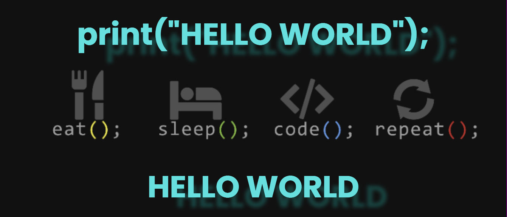

<h1 align="center">Hi 👋, I'm Divyanshu Chaudhary</h1>
<h3 align="center">A passionate frontend developer from India</h3>

  

  

- 🌱 I’m currently learning **Android,Kotlin**

- 👨‍💻 All of my projects are available at [thedivyanshuportfolio.netlify.app](thedivyanshuportfolio.netlify.app)

- 💬 Ask me about **Python,Web Development**

- 📫 How to reach me **divy27092002@gmail.com**

- ⚡ Fun fact **1+1=2!**

<h3 align="left">Connect with me:</h3>

<h3 align="left">Languages and Tools:</h3>

            

&nbsp;

